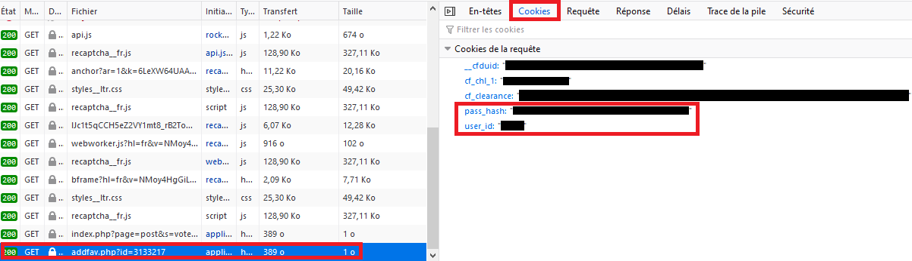

| BooruSharp     | BooruSharp.Others  |
| -------------- | ------------ |
| [](https://www.nuget.org/packages/BooruSharp/) | [](https://www.nuget.org/packages/BooruSharp.Others/) |
|  |  |

| CI | Code Quality | Coverage |
| -- | ------------ | -------- |
| [](https://github.com/Xwilarg/BooruSharp/actions) | [](https://www.codacy.com/manual/Xwilarg/BooruSharp?utm_source=github.com&amp;utm_medium=referral&amp;utm_content=Xwilarg/BooruSharp&amp;utm_campaign=Badge_Grade) | [](https://www.codacy.com/manual/Xwilarg/BooruSharp?utm_source=github.com&amp;utm_medium=referral&amp;utm_content=Xwilarg/BooruSharp&amp;utm_campaign=Badge_Coverage) |

# BooruSharp
BooruSharp is a C# library to browse Booru websites easily<br/>
You can download it from [NuGet](https://www.nuget.org/packages/BooruSharp):
```powershell
Install-Package BooruSharp
```
```powershell
Install-Package BooruSharp.Others
```
BooruSharp currently handle the following websites:
 - booru.allthefallen.moe
 - danbooru.donmai.us
 - e621.net
 - e926.net
 - gelbooru.com
 - konachan.com
 - lolibooru.moe
 - realbooru.com
 - rule34.xxx
 - safebooru.org
 - sakugabooru.com
 - beta.sankakucomplex.com
 - xbooru.com
 - yande.re
 
BooruSharp.Others allow to handle more websites that aren't booru:
 - pixiv.net

## Documentation
Documentation for version > 2.0.0 isn't available for now\
Please either refer to the examples below or use the XML documentation in the code\
If you have any question, feel free to [contact me](#need-more-help)

## Features availability

| Booru | Multiple Random Images | Post by ID | Post by MD5 | Tag by ID | Comment API | Last Comments API | Wiki API | Related Tag API | Post Count API | Favorite API |
| ---                   | --- | --- | --- | --- | --- | --- | --- | --- | --- | --- |
| Atfbooru		| ✔️ | ✔️ | ✔️ | ✔️ | ✔️ | ❌ | ✔️ | ✔️ | ❌ | ❌ |
| Danbooru Donmai	| ✔️ | ✔️ | ✔️ | ✔️ | ✔️ | ❌ | ✔️ | ✔️ | ❌ | ❌ |
| E621			| ✔️ | ✔️ | ✔️ | ❌ | ❌ | ❌ | ❌ | ❌ | ❌ | ❌ |
| E926			| ✔️ | ✔️ | ✔️ | ❌ | ❌ | ❌ | ❌ | ❌ | ❌ | ❌ |
| Gelbooru		| ✔️ | ✔️ | ✔️ | ✔️ | ✔️ | ✔️ | ❌ | ❌ | ✔️ | ✔️ |
| Konachan		| ✔️ | ❌ | ❌ | ✔️ | ✔️ | ✔️ | ✔️ | ✔️ | ✔️ | ❌ |
| Lolibooru		| ✔️ | ❌ | ❌ | ✔️ | ❌ | ✔️ | ✔️ | ✔️ | ✔️ | ❌ |
| Realbooru		| ❌ | ✔️ | ❌ | ✔️ | ✔️ | ✔️ | ❌ | ❌ | ✔️ | ✔️ |
| Rule 34		| ❌ | ✔️ | ❌ | ✔️ | ❌ | ❌ | ❌ | ❌ | ✔️ | ✔️ |
| Safebooru		| ❌ | ✔️ | ❌ | ✔️ | ❌ | ❌ | ❌ | ❌ | ✔️ | ✔️ |
| Sakugabooru		| ✔️ | ❌ | ❌ | ✔️ | ✔️ | ❌ | ✔️ | ✔️ | ✔️ | ❌ |
| Sankaku Complex	| ✔️ | ❌ | ❌ | ❌ | ✔️ | ✔️ | ✔️ | ❌ | ❌ | ❌ |
| Xbooru		| ❌ | ✔️ | ❌ | ✔️ | ✔️ | ✔️ | ❌ | ❌ | ✔️ | ✔️ |
| Yandere		| ✔️ | ❌ | ❌ | ✔️ | ✔️ | ❌ | ✔️ | ✔️ | ✔️ | ❌ |
| Pixiv		        | ❌ | ✔️ | ❌ | ❌ | ❌ | ❌ | ❌ | ❌ | ✔️ | ✔️ |

## Examples

Random image:
```Cs
BooruSharp.Booru.Gelbooru booru = new BooruSharp.Booru.Gelbooru();
BooruSharp.Search.Post.SearchResult result = await booru.GetRandomPostAsync("hibiki_(kantai_collection)", "school_swimsuit");

Console.WriteLine("Image preview URL: " + result.previewUrl.AbsoluteUri + Environment.NewLine +
                  "Image URL: " + result.fileUrl.AbsoluteUri + Environment.NewLine +
                  "Image is safe: " + (result.rating == BooruSharp.Search.Post.Rating.Safe) + Environment.NewLine +
                  "Tags on the image: " + String.Join(", ", result.tags));
```

Get many random images at once:
```Cs
BooruSharp.Booru.SankakuComplex booru = new BooruSharp.Booru.SankakuComplex();
BooruSharp.Search.Post.SearchResult[] result = await booru.GetRandomPostsAsync(10, "ifrit_(arknights)", "silence_(arknights)");

Console.WriteLine(string.Join(Environment.NewLine, result.Select(x => "Random Image: " + x.fileUrl)));
```

Get tag:
```Cs
BooruSharp.Booru.Safebooru booru = new BooruSharp.Booru.Safebooru();
BooruSharp.Search.Tag.SearchResult result = await booru.GetTagAsync("cirno");

Console.WriteLine("Tag type: " + result.type + Environment.NewLine +
                  "ID: " + result.id);
```

Get Wiki entry:
```Cs
BooruSharp.Booru.Konachan booru = new BooruSharp.Booru.Konachan();
BooruSharp.Search.Wiki.SearchResult result = await booru.GetWikiAsync("loli");

Console.WriteLine("Description: " + result.body + Environment.NewLine +
                  "ID: " + result.id + Environment.NewLine +
                  "Created at: " + result.creation.ToString("dd/MM/yy HH:mm:ss") + Environment.NewLine +
                  "Last update at: " + result.lastUpdate.ToString("dd/MM/yy HH:mm:ss"));
```
Get related tags:
```Cs
BooruSharp.Booru.Yandere booru = new BooruSharp.Booru.Yandere();
BooruSharp.Search.Related.SearchResult[] results = await booru.GetRelatedAsync("see_through");

Console.WriteLine(String.Join(Environment.NewLine,
    results.Select(delegate (BooruSharp.Search.Related.SearchResult res) { return ("Name: " + res.name +" (" + res.count + ")"); })));
```
Get comments:
```Cs
BooruSharp.Booru.Lolibooru booru = new BooruSharp.Booru.Lolibooru();
BooruSharp.Search.Comment.SearchResult[] results = await booru.GetCommentAsync(134097);

Console.WriteLine(String.Join(Environment.NewLine,
    results.Select(delegate (BooruSharp.Search.Comment.SearchResult res) { return ("Author: " + res.authorName + ", the " + res.creation.ToString("dd/MM/yy HH:mm:ss") + " - " + res.body); })));
```
Add to favorite:
```Cs
BooruSharp.Booru.Safebooru booru = new BooruSharp.Booru.Safebooru();
booru.SetBooruAuth(new BooruSharp.Booru.BooruAuth("yourUserId", "yourPasswordHash")); // See https://github.com/Xwilarg/BooruSharp/#authentification
await booru.AddFavoriteAsync(1759793);
```
Get all character tags containing a string:
```Cs
BooruSharp.Booru.Yandere yandere = new BooruSharp.Booru.Yandere();
BooruSharp.Search.Tag.SearchResult[] results = await yandere.GetTagsAsync("tsukiko");
Console.WriteLine(String.Join(Environment.NewLine,
	results.Where(delegate (BooruSharp.Search.Tag.SearchResult res) { return (res.type == BooruSharp.Search.Tag.TagType.Character); })
           .Select(delegate (BooruSharp.Search.Tag.SearchResult res) { return (res.name); })));
```

## Authentification

### Booru
For booru authentification, you'll need your user id and your password hash\
To get it, I advise you to go on an image, open the developer panel (F12) and go in "Network"\
Then press the button to add the image to your favorite and look at the "Cookies" section of the last request


### Pixiv
For Pixiv authentification, please use LoginAsync with a refresh token\
To get your refresh token, you can follow this tutorial: https://gist.github.com/ZipFile/c9ebedb224406f4f11845ab700124362

## Want to contribute
Feel free to open a [pull request](https://github.com/Xwilarg/BooruSharp/pulls).

## Need more help
Feel free to [open an issue](https://github.com/Xwilarg/BooruSharp/issues) or come ask [on Discord](https://discord.gg/H6wMRYV).
